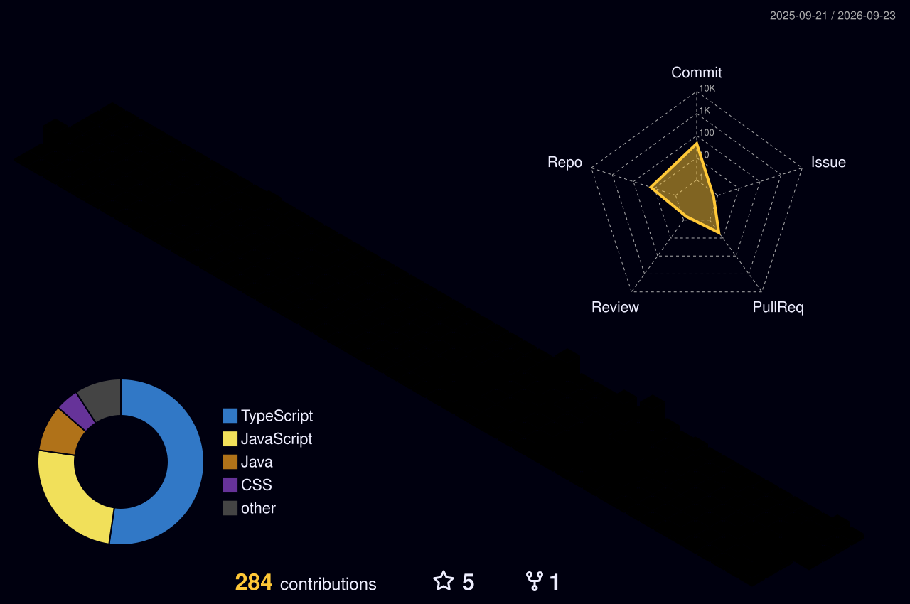

<!-- Header Banner -->

  
  
   
  
  

   

  

    
    
    
  

  

 

  <h2>👨‍💻 About Me</h2>

* 👋 **Hello!** I’m Aditi Singh, a passionate Frontend Developer from India.
* 💻 **What I do:** Create modern and interactive web applications using **HTML**, **CSS**, **JavaScript**, and **React.js**.
* 🌱 **Currently learning:** Advanced **React.js**, **TypeScript**, **MERN Stack**, and exploring **AI integration** in web applications.
* 🎯 **Goals:** Grow as a full-stack web developer, build scalable/impactful projects, and contribute meaningfully to the developer community.
* ✨ **Fun fact:** I enjoy creating mini web projects in my free time, and coffee + coding are my perfect combination ☕💻!

---

  <h2>🛠️ Tech Stack</h2>

  

---

  <h2>📊 Performance Ecosystem</h2>

  

 

  
  

  
  
  

  

---

  <h2>🎮 Contribution Animations</h2>
  
<i>Note: These will appear after the respective GitHub Actions run successfully!</i>

  
<b>🐍 View GitHub Snake (Click to Expand)</b>

   
  

    <picture>
      <source media="(prefers-color-scheme: dark)" srcset="https://raw.githubusercontent.com/Aditisingh0102/Aditisingh0102/output/github-contribution-grid-snake-dark.svg" />
      <source media="(prefers-color-scheme: light)" srcset="https://raw.githubusercontent.com/Aditisingh0102/Aditisingh0102/output/github-contribution-grid-snake.svg" />
      
    </picture>
  

  
<b>👻 View Pac-Man vs Commits (Click to Expand)</b>

   
  

    <picture>
      <source media="(prefers-color-scheme: dark)" srcset="https://raw.githubusercontent.com/Aditisingh0102/Aditisingh0102/output/pacman-contribution-graph-dark.svg" />
      <source media="(prefers-color-scheme: light)" srcset="https://raw.githubusercontent.com/Aditisingh0102/Aditisingh0102/output/pacman-contribution-graph.svg" />
      
    </picture>
  

  
<b>📅 View 3D Contribution Calendar (Click to Expand)</b>

   
  

    <picture>
      <source media="(prefers-color-scheme: dark)" srcset="./profile-3d-contrib/profile-night-rainbow.svg" />
      <source media="(prefers-color-scheme: light)" srcset="./profile-3d-contrib/profile-green-animate.svg" />
      
    </picture>
  

<!-- Footer Banner -->

  

